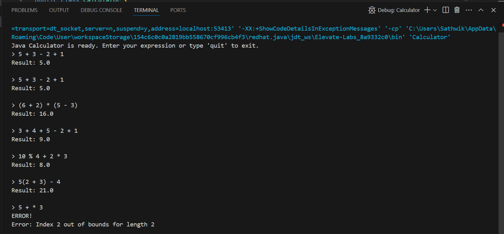

# 🧮 Java Console Calculator

A robust command-line calculator built with Java that handles both basic and advanced mathematical operations with intelligent parsing.

## ✨ Features

### 🔢 Basic Operations
- Addition (`+`), Subtraction (`-`)
- Multiplication (`*`), Division (`/`)
- Modulo (`%`) 

### 📊 Advanced Functions
- Exponentiation: `2^3` = 8
- Square root: `sqrt(25)` = 5
- Base-10 logarithm: `log(100)` = 2

### 🧠 Smart Parsing
- Implicit multiplication: `2(5)` → `2*(5)`
- Nested parentheses: `3*(2+(4/2))`
- Automatic whitespace removal

### 🛡️ Error Handling
- Clear error messages for:
  - Invalid characters
  - Unbalanced parentheses
  - Division by zero
  - Invalid function calls
 
  ## 🖥️ Demonstration

### Successful Calculations

*Examples showing correct calculations including:*
- Basic arithmetic: `5 + 3 - 2 + 1`
- Parentheses handling: `(6 + 2) * (5 - 3)`
- Implicit multiplication: `5(2 + 3) - 4`
- Mixed operations: `10 % 4 + 2 * 3`

### Error Handling

*Examples showing robust error handling for:*
- Division by zero: `4 / 0`
- Invalid characters: `abc + 2`
- Unbalanced parentheses: `2 + (3 * 4`
- Syntax errors: `* 6 + 2`

## 🚀 Getting Started

### Prerequisites
- Java JDK 8+ installed
- Command line terminal

### Installation & Usage

# Compile the program
javac Calculator.java

# Run the calculator
java Calculator

# Example session:
> 2*(3+sqrt(16))
Result: 14.0
> quit
Calculator closed. Goodbye!
> 
 ## 📋 Project Description

A robust, feature-rich command-line calculator application built with Java that combines mathematical precision with intuitive usability. This calculator implements advanced expression parsing and evaluation while maintaining clean, object-oriented design principles.

