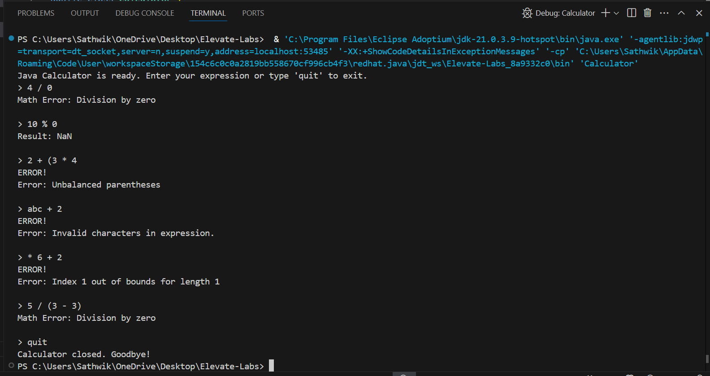

# Java Console Calculator

A feature command-line calculator built with Java that handles basic and advanced mathematical operations.

## 📸 Screenshots

| Feature Demo | Error Handling |
|--------------|----------------|
|  |  |
| *Basic operations and implicit multiplication* | *Error cases and advanced functions* |

## Features

- **Basic Operations**: `+`, `-`, `*`, `/`, `%` (modulo)
- **Advanced Functions**:
  - Power: `^` (e.g., `2^3 = 8`)
  - Square root: `sqrt()` (e.g., `sqrt(25) = 5`)
  - Logarithm (base 10): `log()` (e.g., `log(100) = 2`)
- **Smart Parsing**:
  - Implicit multiplication (e.g., `2(5)` becomes `2*(5)`)
  - Parentheses handling with proper nesting
- **Error Handling**:
  - Clear error messages for invalid inputs
  - Division/modulo by zero protection
  - Balanced parentheses checking

## Development Journey

This project was built by combining:

1. **Core Java knowledge** (variables, methods, control flow)
2. **AI assistance** for:
   - Complex expression parsing logic
   - Edge case handling
   - Code optimization suggestions
3. **Online resources** (YouTube tutorials, Stack Overflow)

## How to Run

1. Compile: `javac Calculator.java`
2. Execute: `java Calculator`
3. Enter expressions when prompted (e.g., `2*(3+sqrt(16))`)
4. Type `quit` to exit

## Example Calculations

5 + 3*(2^4)
Result: 53.0

sqrt(9) + log(100)
Result: 5.0

2(5+1)
Result: 12.0

## Learning Outcomes

Through this project, I gained experience with:
- String manipulation and regular expressions
- Mathematical expression evaluation
- Recursive problem solving
- Input validation techniques
- Using AI as a coding assistant while maintaining full understanding

##  Description

The Java Console Calculator is a feature-rich command-line application 
designed to evaluate complex mathematical expressions with precision and ease. 
Built entirely in Java, this project demonstrates the power of combining core programming 
concepts with modern development tools like AI assistance and online resources.
